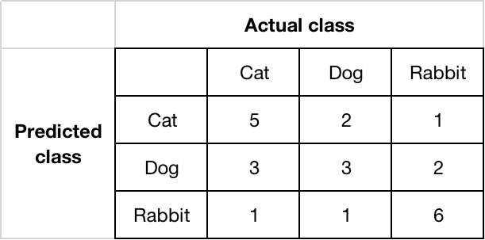
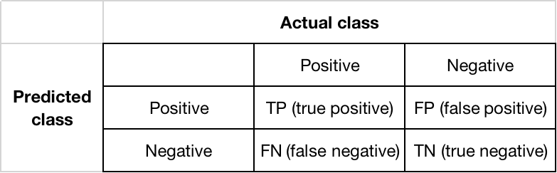
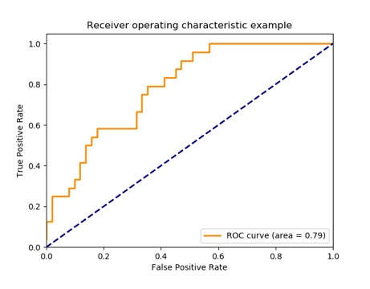

### Accuracy
If $\hat y_i$ is the predicted value of the $i$-th sample and $y_i$ is the corresponding true value, then the fraction of correct predictions over $n_{samples}$ is defined as

$$
accuracy(y, \hat y) = \frac{1}{n_{samples}} \sum_{1}^{n_{samples}} I(\hat y_i=y_i)
$$                         

where $I(x)$ is the [indicator function][1].

[1]: https://en.wikipedia.org/wiki/Indicator_function

### Confusion matrix
A specific table layout that allows visualization of the performance of an algorithm. By definition, $entry(i, j)$ in a confusion matrix is the number of observations actually in group $i$, but predicted to be in group $j$.            

**Example:**

**For binary classification:**

### Precision, Recall and F-measure
we can define the notions of **precision**, **recall** and **F-measure ($F_\beta$)** based on **confusion matrix** of binary classificatio as

$$
precision = \frac{TP}{TP + FP}
$$

$$
recall = \frac{TP}{TP + FN}
$$

$$
F_\beta = (1 + \beta^2) \frac{\text{precision} \times \text{recall}}{\beta^2 \text{precision} + \text{recall}}
$$

For **F-measure**, when $\beta=1$, then call it **$F_1$ score**, which is

$$
F_1 = \frac{2 \times \text{precision} \times \text{recall}}{\text{precision} + \text{recall}}
$$

### ROC and AUC
A **receiver operating characteristic (ROC)**, or simply **ROC curve**, is a graphical plot which illustrates the performance of a binary classifier system as its discrimination threshold is varied. It is created by plotting the fraction of true positives out of the positives (called **true positive rate** or **TPR**) *vs.* the fraction of false positives out of the negatives (called **false positive rate** or **FPR**), at various threshold settings. The predicted results is sorted by target scores which can either be probability estimates of the positive class, confidence values, or binary decisions. And the threshold is to split the target scores, those ones that smaller than threshold is predicted as negative, otherwise is predicted as positive.
**TPR** and **FPR** are defined as

$$
TPR = \frac{TP}{TP + FN}
$$

$$
FPR = \frac{FP}{TN + FP}
$$

An **ROC curve** example:

**AUC** or **AUROC**, is the area under the **receiver operating characteristic (ROC) curve**.

### $R^2$ score, the coefficient of determination
It provides a measure of how well future samples are likely to be predicted by the model. Best possible score is $1.0$ and it can be negative (because the model can be arbitrarily worse). A constant model that always predicts the expected value of $y$, disregarding the input features, would get a $R^2$ score of $0.0$.
If $\hat y$ is the predicted value of the $i$-th sample and $y_i$ is the corresponding true value, then the $R^2$ score estimated over $n$ samples is defined as

$$
R^2(y, \hat{y}) = 1 - \frac{\sum_{i=1}^{n} (y_i - \hat{y}_i)^2}{\sum_{i=1}^{n} (y_i - \bar{y})^2}
$$

where $\bar{y} = \frac{1}{n} \sum_{i=1}^{n} y_i$

### References
<http://scikit-learn.org/stable/modules/model_evaluation.html>
